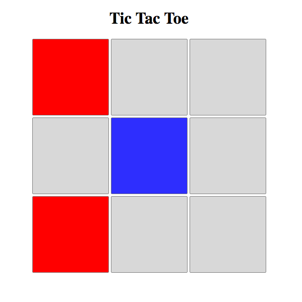

# example-realtime-xo
Learning web development resources for junior

## Screenshot

## Tutorials
- `xo-simple` is a frontend example with javascript for making simple xo.
- `xo-socketio` is the full example for making realtime xo that contains backend (node.js + socket.io) and frontend (similar xo-simple).

## How to use ?
- install `npm` and `node.js`
- run command `npm install` at path that you see `package.json`
- run `npm start` for running server
- open `client/index.html` for starting game

## Challenges
- make `Gomoku`
- make `chat`
- make `user account`
